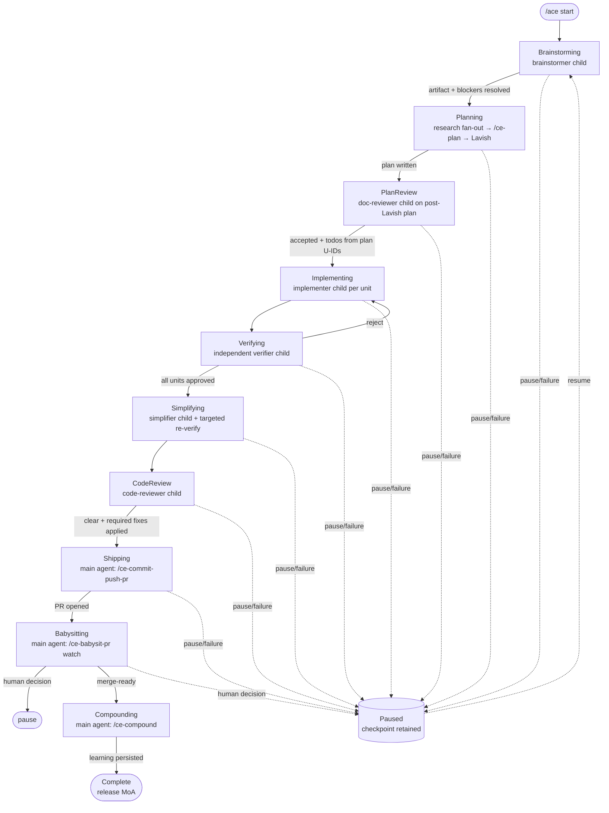

# agentic-compound-engineering

A global [Pi](https://github.com/earendil-works/pi-coding-agent) extension that keeps the main agent on `openai-codex/gpt-5.6-sol`, persists a **resumable** Compound Engineering pipeline, and delegates bounded work to one-model-per-run subagents.

The extension owns **state, commands, dispatch plumbing, and model assignment**. The main agent owns **judgment**. Behavior evolves in prompts; code guarantees persistence and ordering primitives.

> **Attribution:** This extension orchestrates the **Compound Engineering** methodology developed by **[Every.to](https://every.to)** / the Every Inc. team. It coordinates the upstream Compound Engineering skills (`ce-brainstorm`, `ce-plan`, `ce-doc-review`, `ce-code-review`, `ce-simplify-code`, `ce-commit-push-pr`, `ce-babysit-pr`, `ce-compound`, and the research analyst agents) without modifying them. All credit for that workflow design belongs to Every.to. This project is an independent, community-built Pi-native controller for it.

---

## How it flows



Every transition first persists a checkpoint, then advances. `off` suppresses prompts and releases the model-rotation token but **keeps** the saved phase — a restart never silently skips unfinished work.

---

## Prerequisites

- **Pi** (the coding agent) — `npm i -g @earendil-works/pi-coding-agent`
- **pi-subagents** and **pi-ask-user** installed into Pi:
  ```bash
  pi install npm:pi-subagents
  pi install npm:pi-ask-user
  ```
- **Models enabled** in `~/.pi/agent/settings.json > enabledModels`:
  ```json
  "openai-codex/gpt-5.6-sol",
  "openai-codex/gpt-5.4-mini",
  "opencode-go/glm-5.2",
  "opencode-go/deepseek-v4-pro",
  "opencode-go/kimi-k3",
  "opencode-go/grok-4.5"
  ```
- **Authentication:**
  - ChatGPT OAuth for `openai-codex` (main model `gpt-5.6-sol` + child `gpt-5.4-mini`) — prompts on first use.
  - OpenCode credentials/API keys for `opencode-go` models (set `OPENCODE_API_KEYS` for multi-key rotation).
  - GitHub CLI (`gh`) auth for shipping/babysitting: `gh auth login`.
- **RTK** (optional, recommended) — official Pi adapter reduces Bash-output context. See https://github.com/rtk-ai/rtk.

## Install

Clone and run the install script, which copies the extension + agents and fetches the complete `ce-babysit-pr` skill bundle from the pinned EveryInc/compound-engineering-plugin revision:

```bash
git clone https://github.com/AustinDKB/agentic-compound-engineering.git
cd agentic-compound-engineering
./install.sh
```

Then (re)start Pi. You should see the footer status line `ACE: inactive`.

> **What the install script does:**
> 1. Copies `extensions/` and `agents/` into `~/.pi/agent/`.
> 2. Fetches `skills/ce-babysit-pr/` (`SKILL.md` + `references/watch-loop.md` + `scripts/pr-snapshot`) from EveryInc/compound-engineering-plugin@`b7a09f4` into `~/.pi/agent/skills/ce-babysit-pr/` (atomically, with the script made executable). It does **not** touch your other CE skills or settings.
> 3. Reminds you to enable the models listed above.

To install manually instead, see `install.sh` — each step is a standalone `cp`/`curl`.

## Usage

```
/agentic-compound-engineering start   # create a run (preflight → suspend MoA → pin gpt-5.6-sol → begin)
/agentic-compound-engineering status  # compact run summary
/agentic-compound-engineering pause   # checkpoint Paused; release model token; keep state
/agentic-compound-engineering resume  # reacquire token, repin model, continue at the pending gate
/agentic-compound-engineering off     # suppress prompts + release token, BUT retain the checkpoint
```

## Child model catalog

One model is chosen per child run and **persisted before launch** (never re-randomized on resume — preserves provider-side cache locality):

| Provider | Model | Used for |
|----------|-------|----------|
| opencode-go | `glm-5.2` | child work |
| opencode-go | `deepseek-v4-pro` | child work |
| opencode-go | `kimi-k3` | child work |
| opencode-go | `grok-4.5` | child work |
| openai-codex | `gpt-5.4-mini` | child work |

`kimi-k2.7-code` is intentionally excluded in favor of `kimi-k3`. Unavailable/unauthenticated entries are warned-once and skipped. Children run with an explicit model and never inherit per-turn model rotation (`PI_SUBAGENT_PARENT_SESSION` suppresses MoA in child processes).

## Verification

A stub harness (`extensions/agentic-compound-engineering/tests/harness.ts`) plus `bun test` cover the catalog, model-rotation coordination, durable state, dispatcher, orchestration gates, and shipping/compounding ordering — **no live PRs or paid model calls** as the primary automated test path:

```bash
cd extensions/agentic-compound-engineering
bun test tests/
# tsc --noEmit (optional, needs the installed @earendil-works types):
npx -p typescript@5.6 tsc --noEmit -p tsconfig.json
```

## Repo layout

```
extensions/agentic-compound-engineering/   # the extension (index.ts is the factory)
  dispatcher.ts        # typed pi-subagents v1 delegation; backpressure; writer-overlap guard
  state.ts             # durable per-cwd run registry; redaction; locks; reconstruction
  model-catalog.ts     # multi-provider 5-model catalog; seeded assignment; cache reuse
  types.ts
  delegation-constants.ts   # local protocol shim (no node_modules resolution needed)
  prompts/{orchestrator,shipping}.md
  tests/*.test.ts
extensions/mixture-of-agents.ts            # MoA with suspension-token contract + child isolation
agents/agentic-compound-*.md               # 6 pipeline child role definitions
install.sh                                 # copies files + fetches the babysit bundle
```

Runtime state (checkpoints, registry, artifacts) lives under `~/.pi/agent/agentic-compound-engineering/runs/` — operational data, not source-controlled.

## License

MIT — see [`LICENSE`](LICENSE).

## Credits

- **Compound Engineering** methodology and the CE skills/agents: **Every.to** — https://every.to — and the upstream plugin at https://github.com/EveryInc/compound-engineering-plugin (babysit bundle installed from commit `b7a09f4`).
- **pi-subagents** delegation API: https://github.com/nicobailon/pi-subagents
- **Pi** (coding agent): https://github.com/earendil-works/pi-coding-agent
- **RTK** (optional Pi adapter): https://github.com/rtk-ai/rtk

This project is independent and not affiliated with or endorsed by Every.to.